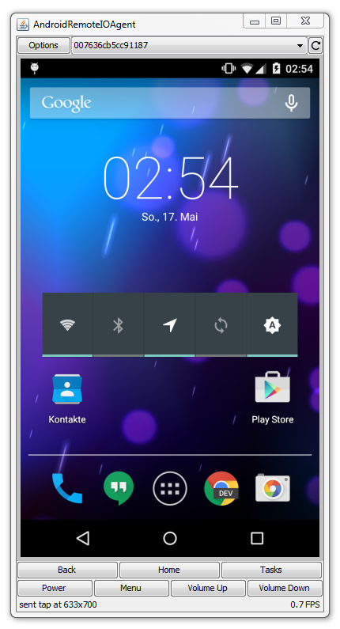

Android Remote I/O Agent
========================

This tool mirrors the screen of an Android device and allows interaction with it. This can be especially useful when dealing with a broken screen. Root should **not** be required.

Prerequisites
-------------

* [Java 1.7+](http://java.com/download/)
* [Android SDK](http://developer.android.com/sdk/installing/index.html)
* Enabled USB-Debugging. If you are unable to enable it using your options menu, try [this walkthrough](http://android.stackexchange.com/a/23928/42806).
* [Download the latest jar](https://github.com/wue-bros/AndroidRemoteIOAgent/releases) or build it from source

How to Use
----------

### Gestures

* Click &rarr; Tap
* Click & Drag &rarr; Swipe
* Click & Hold &rarr; Long Press
* Mouse Wheel &rarr; Swipe Up/Down
* Keyboard &rarr; Text Input

### Options

* **ADB path** &mdash; path to the `adb` executable in the Android SDK; default works if ADB is in your PATH
* **Temporary file (device)** &mdash; where to store mirroring screenshots on your Android device; default should work for most devices
* **Temporary file (client)** &mdash; where to store mirroring screenshots on the PC; defaults to the working directory
* **Long press duration (milliseconds)** &mdash; time your Android device needs to recognize a long press
* **Scroll speed** &mdash; how fast the mouse wheel scrolls on the Android device

How to Build
------------

    mvn clean compile assembly:single
